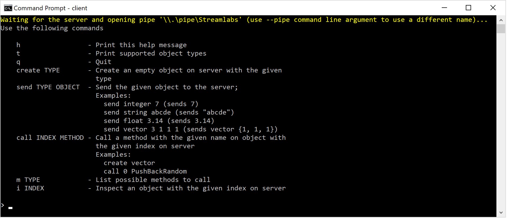

# StreamLabs Assignment

## Binaries

Binaries for Windows 32-bit/64-bit are located in `builds/`.

## Overview

This repository contains simple client/server console applications for Windows which can communicate through named pipe.

Application makes use of:

 * CMake - for builds
 * [cxxopts](https://github.com/jarro2783/cxxopts) - for command line options
 * [Asio](https://think-async.com/) - Powerful C++ network + I/O library which provides convenient interface for communication through a pipe handle; it supports both asynchronous and synchronous I/O, which is very useful for purposes of this application
 * [fmtlib](https://github.com/fmtlib/fmt) - Handy replacement for `cout` and `printf`, provides string formatting
 
 Server just maintains an indexed list with all objects which come from client.
 
 Client is able to create a new object. In addition, it is able to call a method on existing objects (if it has any).
 
 Server can easily register a new method on existing object. It can easily create a new object type (class) as well.
 
 However, for demonstration purposes we stick with only 4 object types: `integer`, `float`, `string`, `vector`. The server could be easily extended for more types if needed.
 
 Right now, only `vector` has registred method which could be called outside of server by client.

## Usage

First you need to run the server
```bash
server
```
it will use the default pipe path. If you want to use a different path, use `--pipe` option:
```bash
server --pipe \\.\pipe\my
```
See `--help` for details:
```bash
server --help
```

Then you need to run the client
```bash
client
```
it has exactly the same command line options as the server.

If you managed to open the client, you will see a welcoming prompt and a help message. Type `h` command to see a help message with all the available commands.

Now you can play with the client. Have fun!


